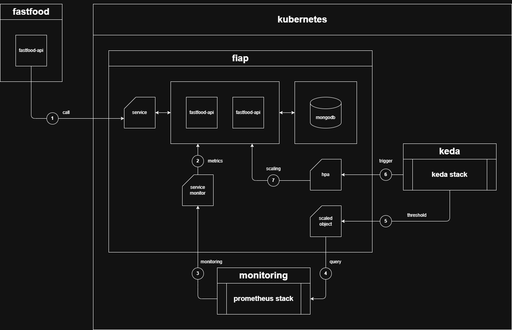

# 🍔 FastFood API

Este projeto foi desenvolvido para o curso de [pós-graduação em Arquitetura de Software (Soat Póstech) da FIAP](https://postech.fiap.com.br/curso/software-architecture/).

A API presente neste repositório disponibiliza rotas para gerenciamento de clientes, cardápio, pedidos e pagamentos, com integração direta com [MongoDB](https://www.mongodb.com/) e [Mercado Pago](https://www.mercadopago.com.br/developers/pt/reference).

## 🏃 Integrantes do grupo 21

- Jeferson dos Santos Gomes - **RM 362669**
- Jamison dos Santos Gomes - **RM 362671**
- Alison da Silva Cruz - **RM 362628**

## 📜 Linguagem Ubíqua 

Para mais detalhes sobre a linguagem do domínio, consulte [`docs/ubiquitous-language.md`](docs/ubiquitous-language.md).

## 🗂️ Diagramas do Projeto

Os seguintes diagramas estão disponíveis no diretório [`/diagrams`](diagrams):

- **Diagrama de Contexto:** Apresenta uma visão geral dos sistemas e atores que interagem com a FastFood API, destacando integrações externas e fluxos principais.

- **Event Storming:** Ilustra os principais eventos de negócio, comandos e agregados do domínio, facilitando o entendimento dos fluxos e regras do sistema.

- **Domain Storytelling:** Mostra narrativas visuais dos processos de negócio, detalhando como os diferentes atores interagem com o sistema em cenários típicos.

Consulte o diretório [`/diagrams`](diagrams) para visualizar os arquivos e obter mais detalhes sobre cada diagrama.

## 👨‍💻 Tecnologias Utilizadas

- **.NET 8** (C# 12)
- **ASP.NET Core Web API**
- **MongoDB** (banco de dados)
- **Mongo Express** (cliente web para MongoDB)
- **Docker** e **Docker Compose**
- **Kubernetes** (gerenciamento de containers)
- **Keda** (escalonamento)
- **Prometheus** (métricas)
- **Polly** (resiliência HTTP)
- **Swagger** (documentação automática)
- **MercadoPago** (integração de pagamentos via Pix)

## 🏁 Como Inicializar

### Pré-requisitos

- 🐈‍⬛ Clonar este [Repositório](https://github.com/jefersondsgomes/fiap-soat-fastfood)
- 🐳 Instalar o [Docker](https://www.docker.com/get-started/)
- ☸️ Habilitar o Kubernetes no [Docker](https://docs.docker.com/desktop/features/kubernetes/)

Podemos executar essa aplicação de 2 maneiras diferentes:

### 1. **Docker**:

No diretório raiz do projeto, utilize uma ferramenta de linha de comando de sua preferência e execute o comando `docker-compose up --build`.

A API e seus recursos estão disponíveis em:
- **API**: [http://localhost:8080/swagger](http://localhost:8080/swagger)
- **Mongo Express**: [http://localhost:8081](http://localhost:8081)

### 2. **Kubernetes**:

No nosso repositório temos o diretório `/k8s` onde disponibilizamos todos os manifestos associados ao deploy e configuração da nossa API e banco de dados. Nesse contexto, temos a possibilidade de escalar nossa aplicação com base em métricas fornecidas pela API.

Para utilizar esses recursos, precisaremos de alguns passos adicionais para preparação do ambiente:

2.1 **Criar `namespaces` personalizados no Kubernetes**:

   Com o cluster **K8s** habilitado, precisaremos executar os seguintes comandos:

   - `kubectl create namespace fiap`
   - `kubectl create namespace keda`
   - `kubectl create namespace monitoring`

2.2 **⚓ [Instalar o Helm](https://helm.sh/docs/intro/install/)**

   O Helm é um gerenciador de pacotes para o Kubernetes e, através dele, podemos provisionar aplicações e ambientes inteiros de maneira simplificada. 

   Para facilitar as coisas, essa instalação também pode ser feita a partir do comando abaixo:

   - `curl https://raw.githubusercontent.com/helm/helm/main/scripts/get-helm-3 | bash`

2.3 **Configurar serviços adicionais no K8s**:

   Temos 2 serviços principais que precisam estar em execução no nosso cluster **K8s** para que seja possível coletar as métricas da nossa aplicação e ajustar a escala dinamicamente. Para instalar esses recursos, precisamos que o **Helm** (passo 2) esteja disponível.

   ##### - **Instalação do [KEDA](https://keda.sh/docs/2.9/deploy/)**

   O **KEDA** é um componente para o **K8s** que estende as capacidades do HPA. Ele permite que as aplicações escalem automaticamente com base em métricas de eventos externas, indo muito além das métricas de CPU e memória padrão.

   Utilizando o **Helm**, execute os comandos abaixo:
   
   - `helm repo add kedacore https://kedacore.github.io/charts`
   - `helm repo update`
   - `helm install keda kedacore/keda -n keda`

   ##### - **Instalação do [Prometheus](https://grafana.com/docs/grafana-cloud/monitor-infrastructure/kubernetes-monitoring/configuration/config-other-methods/prometheus/prometheus-operator/)**

   O **Prometheus** é uma ferramenta de monitoramento e alertas voltada para métricas de sistemas. Ele coleta dados em tempo real por meio de pulls em endpoints HTTP. As métricas são armazenadas em uma base de dados temporal e podem ser consultadas com a linguagem PromQL.

   Execute os comandos abaixo:

   - `helm repo add prometheus-community https://prometheus-community.github.io/helm-charts`
   - `helm repo update`
   - `helm install prometheus prometheus-community/kube-prometheus-stack -n monitoring`
   - `helm install prometheus-adapter prometheus-community/prometheus-adapter -n monitoring`
   
   ##### - Instalação do [Metrics Server](https://github.com/kubernetes-sigs/metrics-server)

   O **Metrics Server** é um agregador de métricas de recursos usado pelo Kubernetes para fornecer dados de uso de CPU e memória dos pods e nodes. Ele é essencial para o funcionamento do HPA (Horizontal Pod Autoscaler) e para que ferramentas como o KEDA possam escalar os pods com base nessas métricas.

   Para instalar o Metrics Server, execute os comandos abaixo:

   ```sh
   kubectl apply -f https://github.com/kubernetes-sigs/metrics-server/releases/latest/download/components.yaml
   ```

   Se estiver rodando o cluster localmente (ex: Docker Desktop), pode ser necessário ajustar o deployment para permitir conexões inseguras (por exemplo, adicionar o argumento `--kubelet-insecure-tls`):

   ```sh
   kubectl -n kube-system edit deployment metrics-server
   ```
   Adicione o argumento abaixo em `spec.containers.args`:
   ```yaml
   - --kubelet-insecure-tls
   ```

   Após a instalação, verifique se o Metrics Server está funcionando corretamente:

   ```sh
   kubectl get --raw "/apis/metrics.k8s.io/v1beta1/nodes"
   ```

   Se retornar dados dos nodes, está tudo certo!

2.4 Aplicar manifestos

Acesse o diretório `/k8s` e execute o comando `kubectl apply -f .`, isso fará com que todos os recursos descritos nos manifestos sejam aplicados no **K8s**. Com essa ação, teremos as APIs disponíveis em `http://localhost:30080`.

---

### Arquitetura K8s:



## Dicas e Truques:

- Utilize o Kubernetes com **[K9S](https://k9scli.io/)**: O **K9S** é uma interface para terminal que permite uma navegação simplificada entre os recursos do Kubernetes. É uma excelente ferramenta de produtividade, pois elimina as diversas chamadas que normalmente são realizadas através do `kubectl`.

- Utilize o **[K6](https://k6.io/)** para testar o scaling: O **K6** é uma ferramenta para execução de testes de carga. Neste projeto, temos o diretório `/k6` onde disponibilizamos scripts que irão estressar alguns endpoints do nosso serviço e, caso esteja executando no **K8s**, será possível verificar o scaling up e scaling down.

- Visualize as informações no **Prometheus**: No **K8s** temos uma stack do Prometheus em execução e é possível fazer um port-forward para que a UI seja acessível externamente. Para isso, execute o comando `kubectl port-forward -n monitoring svc/prometheus-kube-prometheus-prometheus 9090` e acesse em `http://localhost:9090`.

## Endpoints Disponíveis

### 🍔 Order (Pedido)
- `GET /order?page=1&size=10&status=Received` — Listar todos pedidos em página
- `GET /order/active?page=1&size=10` — Listar pedidos ativos em página de forma ordenada e excluindo pedidos inativos.
- `GET /order/{id}` — Detalhar pedido
- `POST /order` — Criar pedido
- `PATCH /order/{id}/status` — Atualizar status do pedido
- `DELETE /order/{id}` — Remover pedido

### 💸 Transaction (Pagamento)
- `POST /order/{id}/checkout` — Iniciar checkout/pagamento
- `POST /order/{id}/confirm-payment` — Confirmar pagamento
- `POST /order/payment/webhook` — Webhook de pagamento

### 🤖 SelfOrdering (Cliente)
- `GET /self-ordering/customer/{id}` — Buscar cliente por ID
- `GET /self-ordering/customer/{cpf}` — Buscar cliente por CPF
- `POST /self-ordering/customer` — Registrar cliente

### 📲 Menu (Cardápio)
- `GET /menu/{id}` — Detalhar item do cardápio
- `GET /menu?name=string&category=0&skip=0&limit=10` — Listar itens do cardápio
- `POST /menu` — Cadastrar item no cardápio
- `PUT /menu/{id}` — Atualizar item do cardápio
- `DELETE /menu/{id}` — Remover item do cardápio

### 🏥 HealthCheck (Saúde)
- `GET /healthz` — Saúde da API
- `GET /health` — Saúde da API e suas dependências

### 📈 Metrics (Métricas)
- `GET /metrics` — Métricas do Prometheus

Se preferir, as requisições descritas acima podem ser acessadas via [Postman](https://www.postman.com/) por meio da seguinte documentação:

- [fiap-soat-fastfood](https://documenter.getpostman.com/view/7741479/2sB3BAMYQs)

## 👤 Convenções

- Todos os endpoints aceitam e retornam JSON.
- Utilize o Swagger para explorar e testar os endpoints.

## 🏦 Banco de Dados

- O MongoDB inicializa com uma seed de dados para um cardápio pré-preenchido. Isso ocorre via script em `scripts/init-db.js`.
- Por padrão o script não esta com os valores de usuário e senha configurados é necessário realizar a configuração manualmente, é possivel encontrar através dos placeholders: {{username}} e {{password}}.

---

## 🧩 Arquitetura: Princípios SOLID & Clean Architecture

Este projeto foi estruturado seguindo os princípios do **SOLID** e os conceitos do **Clean Architecture**, visando garantir um sistema desacoplado, coeso, testável e de fácil manutenção.

### Princípios SOLID

- **S**ingle Responsibility Principle (Responsabilidade Única):  
  Cada classe ou módulo possui uma única responsabilidade bem definida, facilitando a manutenção e evolução do código.

- **O**pen/Closed Principle (Aberto/Fechado):  
  Os componentes do sistema são abertos para extensão, mas fechados para modificação, permitindo adicionar novas funcionalidades sem alterar o código existente.

- **L**iskov Substitution Principle (Substituição de Liskov):  
  As subclasses podem ser substituídas por suas classes base sem afetar o funcionamento do sistema.

- **I**nterface Segregation Principle (Segregação de Interfaces):  
  Interfaces específicas são preferidas a interfaces genéricas, evitando que classes dependam de métodos que não utilizam.

- **D**ependency Inversion Principle (Inversão de Dependência):  
  O domínio depende de abstrações (interfaces), e não de implementações concretas, promovendo baixo acoplamento entre as camadas.

### Clean Architecture

- **Separação de Camadas:**  
  O projeto é dividido em camadas bem definidas, separada por projetos de Business, Adapters, Drivers(Api, Infrastructure)

- **Isolamento da Lógica de Negócio:**  
  A lógica de negócio reside na camada de domínio (Business), isolada de detalhes técnicos e de infraestrutura.

- **Gateways e Interfaces:**  
  Dependências externas (bancos de dados, APIs, etc.) são representadas por interfaces na camada de domínio. As implementações concretas ficam na infraestrutura.

- **Injeção de Dependências:**  
  A ligação entre interfaces e implementações é feita via injeção de dependências, facilitando testes e substituição de componentes.

**Benefícios:**
- Facilita testes unitários e integração.
- Permite evolução e manutenção do sistema sem impactar a lógica de negócio.
- Garante flexibilidade para trocar tecnologias e integrações externas.
- Segue as melhores práticas de arquitetura de software moderna.

> **Resumo:**  
> O projeto foi desenhado para que cada camada tenha responsabilidades claras e isoladas, promovendo um código limpo, sustentável e preparado para mudanças futuras.
